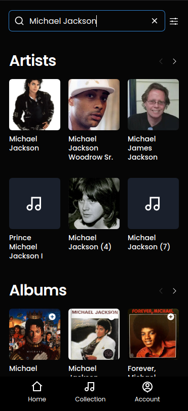

# BE4T

> Manage your music collection with BE4T.

Have you ever wonder how much your music collection might be valued on? Maybe you are missing one album to complete it? BE4T helps music collectors manage their albums with the most intuitive UI and the useful information provided from [DISCOGS](https://www.discogs.com/).

## Built With

- React
- NextJS
- Chakra-UI

## [Live Demo](https://be4t.netlify.app/)

## Getting started

To get started, simply clone this repo and execute `yarn install` or `npm run install` to install the packages, then `cd` into the challenge directory and do `yarn dev` or `npm run dev` to start the Next JS server.

Create a `.env.local` file and set up a `token` of personal access from Discogs like this: `NEXT_PUBLIC_DISCOGS_URL=token`.

Open [http://localhost:3000](http://localhost:3000) with your browser to see the result.

## Author

👤 **Daniel Jaramillo**

- GitHub: [@d4nielj](https://github.com/d4nielj)
- Twitter: [@d4niel_jm](https://twitter.com/d4niel_jm)
- LinkedIn: [d4nielj](https://linkedin.com/in/d4nielj)

## 🤝 Contributing

Contributions, issues, and feature requests are welcome!

Feel free to check the [issues page](../../issues/).

## Show your support

Give a ⭐️ if you like this project!

## 📝 License

This project is [MIT](./LICENSE) licensed.

This is a [Next.js](https://nextjs.org/) project bootstrapped with [`create-next-app`](https://github.com/vercel/next.js/tree/canary/packages/create-next-app).
